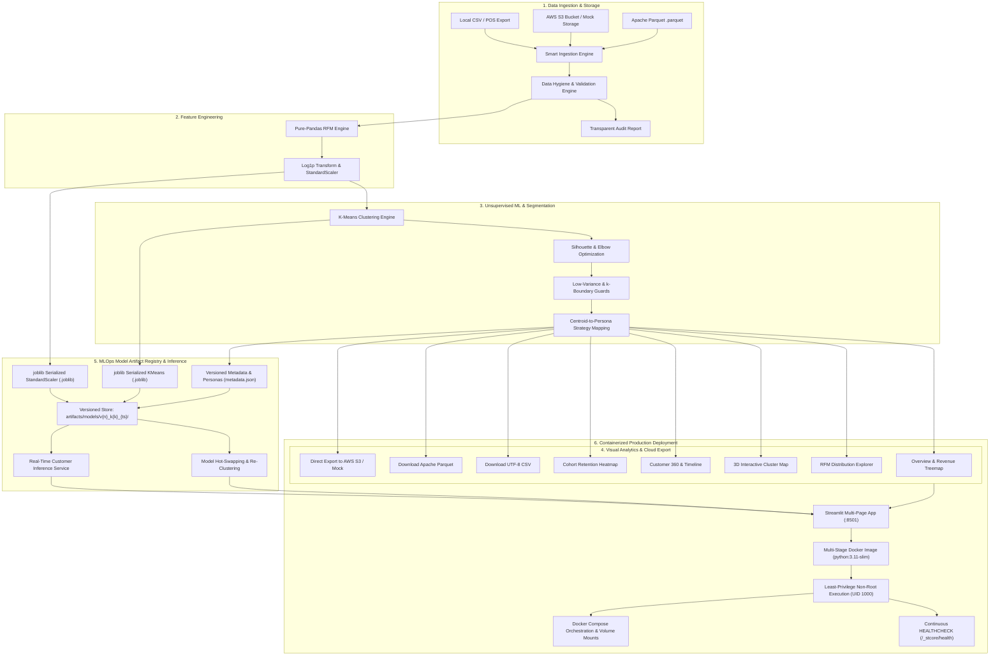

# 🎯 RFM Cluster360 — Customer Intelligence & Behavioral Segmentation

[](https://www.python.org/)
[](https://streamlit.io/)
[](https://scikit-learn.org/)
[](https://plotly.com/)
[](https://aws.amazon.com/s3/)
[](https://parquet.apache.org/)
[](Dockerfile)
[](#-mlops-model-artifact-registry)
[](#-running-the-test-suite)
[](LICENSE)

An enterprise-ready customer intelligence and segmentation platform that transforms raw retail transaction exports into actionable customer personas using **Recency, Frequency, and Monetary (RFM)** modeling and **Unsupervised Machine Learning (K-Means Clustering)**.


---

## 🌟 Key Features

1. **Intelligent Ingestion & Auto-Column Mapping**
   - Upload any standard retail transaction CSV (Shopify, WooCommerce, Square, POS exports).
   - Fuzzy matching and alias detection automatically map column variations (e.g. `cust_id`, `ClientID`, `InvoiceNo`, `created_at`).
   - Supports multiple encodings (`utf-8`, `latin-1`, `cp1252`, `iso-8859-1`) with file size validation guards.
   - Robust input handling supporting file paths, raw bytes, and `io.StringIO` / `io.BytesIO` objects.

2. **Cloud Storage Ingestion & Export (AWS S3 + Local Mock)**
   - **Direct S3 Ingestion:** Pull transaction datasets directly from AWS S3 buckets (supports both `.csv` and `.parquet`).
   - **Offline Demo / Mock Mode:** Built-in local mock storage (`data/mock_s3/`) allowing zero-credential testing and local demos (`USE_LOCAL_MOCK=true`).
   - **Direct Cloud Export:** Push segmented customer audiences directly back to your S3 data lake or CRM staging bucket.
   - **Credential Security:** Configured through environment variables (`AWS_ACCESS_KEY_ID`, `AWS_SECRET_ACCESS_KEY`, `AWS_DEFAULT_REGION`) or masked session overrides.

3. **Apache Parquet High-Performance Serialization**
   - High-efficiency columnar storage powered by `pyarrow` for both ingestion and exports.
   - Up to **88% storage size reduction** compared to traditional CSV files with faster load times and native schema preservation.
   - Interactive download format toggle (UTF-8 CSV vs. Snappy-compressed Apache Parquet).

4. **Transparent Data Hygiene Audit & Integrity Engine**
   - Automatically filters guest checkouts, cancelled orders (`C` prefix), returns, and zero-price test line items.
   - **Accounting Negatives:** Converts accounting parenthesis format (e.g., `(10.50)` &rarr; `-10.50`) to avoid converting refunds into positive revenue.
   - **ID Normalization:** Harmonizes mixed-type customer IDs (e.g. float `1001.0` and string `"1001.0"` &rarr; `"1001"`).
   - **Invoice Validation:** Filters null or empty invoice numbers to prevent orphaned zero-frequency customer profiles.
   - Displays clear before/after counts and an itemized breakdown of filtered rows without silent data loss.

5. **Pure-Pandas RFM Engine**
   - Computes **Recency** (days since last purchase), **Frequency** (count of distinct orders), and **Monetary** (total lifetime spend) per customer.
   - Configurable reference snapshot date (defaults to midnight after the latest transaction).

6. **Self-Optimizing K-Means Clustering & Guardrails**
   - Normalizes right-skewed distributions with $\log(1+x)$ transformations followed by `StandardScaler`.
   - Automatically searches $k=2$ through $8$ and identifies optimal clustering using **Silhouette Score** maximization and the **Elbow Method**.
   - **Low-Variance Guard:** Detects uniform/near-zero variance data (`std < 0.01`) before fitting to prevent convergence warnings and warn users proactively.
   - Dynamic sidebar slider for instant interactive $k$ adjustments with edge-case protection.

7. **Explainable Customer Personas & Strategy Mapping**
   - **Weighted Composite Ranking:** Centroids are ranked via a balanced composite ($0.35 \times R_{\text{inv}} + 0.35 \times F + 0.30 \times M$), ensuring the top cluster always receives top-tier classification.
   - Translates mathematical cluster centroids into intuitive business personas:
     - 🏆 **Champions**: Top spenders who buy frequently and recently.
     - 🤝 **Loyal Customers**: Regular repeat buyers with solid lifetime value.
     - 🚀 **Potential Loyalists**: Recent shoppers with high growth potential.
     - 🌱 **New Customers**: First-time or very recent buyers.
     - ⚠️ **At Risk**: High historical spenders who haven't returned recently.
     - 💤 **About to Sleep / Lost**: Inactive customer base.
   - **Collision-Free Qualifiers:** Automatically appends ordinal qualifiers (e.g., `Needs Attention (Tier 2)`) when $k \ge 10$ to ensure every cluster retains a distinct label.
   - Actionable marketing recommendations and targeted campaign playbooks for each persona.

8. **Interactive 5-View Analytics Dashboard**
   - **📊 Overview**: High-level KPIs, customer count/revenue distribution by segment, market treemaps, and zero-spend protected scatter plots.
   - **🔍 RFM Explorer**: Metric distribution histograms, percentile statistics, and Elbow & Silhouette model diagnostics.
   - **🗺️ 3D Cluster Map**: Fully rotatable 3D customer space with zoom, pan, and 2D cross-section projections.
   - **👤 Customer Search**: Look up individual accounts, benchmark rankings across the base, and purchase timelines.
   - **📈 Cohort Retention**: Monthly acquisition cohort retention heatmap with contiguous period reindexing and adaptive high-contrast font colors.

9. **Blazing-Fast Reactive Performance**
   - Computationally intensive operations (`load_csv`, `calculate_rfm`, `preprocess_rfm`, `evaluate_clusters`) are accelerated with `@st.cache_data`.
   - Instant response times on sidebar filter changes and interactive exploration.

10. **One-Click Multi-Format & Cloud Export**
   - Download the full segmented customer list with RFM metrics, cluster IDs, and persona labels in UTF-8 CSV or Apache Parquet formats.
   - Upload directly to AWS S3 buckets or local mock storage from the export interface.

11. **Production Docker Containerization & Health Checks**
   - **Multi-Stage Build:** Stage 1 virtualenv builder isolates pip compilation overhead; Stage 2 runtime image uses slim `python:3.11-slim` footprint (~180MB).
   - **Automated Health Check:** `HEALTHCHECK` continually inspects Streamlit's native `/_stcore/health` endpoint.
   - **Principle of Least Privilege:** Executes under an unprivileged `appuser` (UID 1000) non-root user.
   - **Docker Compose:** One-command local spinup (`docker compose up --build`) with volume persistence for `/app/data` and environment fallbacks.

12. **MLOps Model Artifact Registry & Live Inference Service**
   - **Artifact Serialization:** Persists trained Scikit-Learn `KMeans` models and fitted `StandardScaler` transformers using `joblib`.
   - **Complete Metadata Tracking:** Every artifact version stores UTC creation timestamps, cluster counts ($k$), inertia, silhouette scores, feature definitions, and persona mappings in `metadata.json`.
   - **Automated Pipeline Persistence:** Models are automatically snapshotted upon pipeline execution and hot-swappable on the fly.
   - **Cross-Version Benchmarking:** Side-by-side silhouette score comparison charts and inertia curve analytics across model versions.
   - **Real-Time Customer Classifier:** Interactive inference playground allowing sales/marketing teams to input arbitrary RFM metrics and instantly receive assigned cluster IDs, persona badges, and targeted marketing strategies.


---

## 🏛️ Project Architecture

### End-to-End Data Pipeline Flow



### Directory Structure

```
rfm-cluster360/
├── app.py                          # Streamlit entrypoint, pipeline orchestrator & S3 ingestion tab
├── Dockerfile                      # Multi-stage production container definition (builder + runner)
├── docker-compose.yml              # Local container orchestration, volume persistence & health checks
├── .dockerignore                   # Build exclusion rules for lean, secure container images
├── HOW_TO_RUN.txt                  # Quick launch terminal commands and setup guide
├── requirements.txt                # Pinned dependencies (including boto3, pyarrow, joblib)
├── .env.example                    # Template for AWS S3 and application environment variables
├── .gitignore
├── README.md
├── LICENSE                         # Apache 2.0 License
├── pyrightconfig.json              # Python static type checking configuration
│
├── artifacts/                      # MLOps Model Artifact Registry (Git-ignored)
│   └── models/                     # Versioned model directories (v{n}_k{k}_{timestamp})
│       └── v1_k4_.../
│           ├── kmeans_model.joblib # Serialized Scikit-Learn KMeans estimator
│           ├── scaler.joblib       # Serialized StandardScaler transformation
│           └── metadata.json       # Metrics, k, silhouette, inertia, persona mapping
│
├── config/
│   └── settings.py                 # Configuration constants, aliases, S3 configs, registry paths
│
├── data/
│   ├── sample_retail.csv           # Built-in demo transaction dataset
│   └── mock_s3/                    # Offline S3 mock directory for local development & testing
│       └── retail-data/
│           ├── transactions.csv
│           └── transactions.parquet
│
├── src/                            # Core computational engine (Modular, testable, zero UI dependencies)
│   ├── ingestion.py                # CSV loading, encoding fallbacks, fuzzy column mapping, @st.cache_data
│   ├── cloud_storage.py            # AWS S3 bucket loader & uploader, local mock fallback, moto support
│   ├── cleaning.py                 # Hygiene rules, accounting negatives, ID normalization, CleaningReport
│   ├── rfm.py                      # Pure-Pandas RFM calculation, summary stats, @st.cache_data
│   ├── clustering.py               # Log transforms, scaling, K-Means, silhouette evaluation, variance guard
│   ├── personas.py                 # Composite score ranking, collision-free persona classification
│   ├── cohort.py                   # Monthly acquisition cohort retention matrix with contiguous reindexing
│   ├── model_registry.py           # MLOps serialization, version listing, loading, and live inference
│   └── export.py                   # Clean CSV & Apache Parquet (pyarrow) serialization
│
├── pages/                          # Streamlit Multipage Navigation
│   ├── 1_Overview.py               # High-level KPIs, distributions, and playbooks
│   ├── 2_RFM_Explorer.py           # Distributions, percentile metrics, model diagnostics
│   ├── 3_Cluster_Map.py            # 3D interactive customer space & 2D slices
│   ├── 4_Customer_Search.py        # Customer lookup, timeline, and percentile rankings
│   ├── 5_Cohort_Retention.py       # Acquisition cohort retention heatmaps
│   └── 6_Model_Registry.py         # MLOps versioning, model benchmarking, and live inference
│
├── components/                     # Reusable Streamlit UI widgets
│   ├── metric_cards.py             # Executive KPI metrics & persona cards
│   ├── filters.py                  # Sidebar segment, country, and bounded spend range filters
│   ├── data_preview.py             # Column mapping editor & itemized cleaning audit cards
│   └── download_button.py          # CSV/Parquet toggle and direct AWS S3 upload section
│
├── viz/                            # Chart builders (Return pure Plotly Figures)
│   ├── overview_charts.py          # Segment volume, revenue, treemap, log-safe scatter plot
│   ├── rfm_charts.py               # Histograms, elbow curve, silhouette curve, radar charts
│   ├── cluster_scatter.py          # 3D scatter & 2D pairwise projections
│   ├── customer_timeline.py        # Individual customer timeline & percentile ranking
│   └── cohort_heatmap.py           # Annotated cohort retention heatmap with adaptive text contrast
│
└── tests/                          # Automated Pytest Suite (48 Passed)
    ├── conftest.py                 # Hand-calculated transaction fixtures & synthetic base
    ├── test_ingestion.py           # Encodings, empty files, fuzzy mapping, duplicate detection, StringIO
    ├── test_cloud_storage.py       # S3 moto mocks, Parquet serialization roundtrip, mock mode, validation
    ├── test_cleaning.py            # Deduplication, currency strings, accounting negatives, ID normalization
    ├── test_rfm.py                 # Hand-calculated RFM metrics, snapshot dates, summary stats, zero-monetary
    ├── test_clustering.py          # Preprocessing, evaluation, profiles, low-variance guard
    ├── test_personas.py            # Centroid labeling, synthetic customer groups, k=10 collision handling
    ├── test_cohort.py              # Cohort retention calculations, KPIs, non-contiguous month reindexing
    ├── test_docker_config.py       # Multi-stage Dockerfile, docker-compose syntax, and .dockerignore rules
    └── test_model_registry.py      # Artifact save/load roundtrips, version listing, deletion, live inference
```

---

## 🗺️ Engineering Roadmap & Implementation Progress

| Phase | Milestone | Focus Areas | Status |
|:---:|---|---|:---:|
| **0** | **Repository Bootstrap** | Git repo initialization, `.gitignore`, architecture documentation, initial push | ✅ Complete |
| **1** | **Critical Bug Fixes** | Slider step overflow, duplicate column mapping, StringIO type error, k-slider edge cases | ✅ Complete |
| **2** | **Data Integrity & Cleaning** | Accounting parentheses, float-string ID normalization, null invoice validation | ✅ Complete |
| **3** | **ML Pipeline Robustness** | Percentile composite persona ranking, $k \ge 10$ collision qualifiers, low-variance clustering guard | ✅ Complete |
| **4** | **Visualization & UI** | Cohort contiguous month reindexing, adaptive heatmap text contrast, log-scale $0 scatter safety, `@st.cache_data` | ✅ Complete |
| **5** | **Cloud Integration** | AWS S3 bucket ingestion/export with local mock mode + Apache Parquet support | ✅ Complete |
| **6** | **Containerization** | Multi-stage production `Dockerfile`, `docker-compose`, health checks, non-root security | ✅ Complete |
| **7** | **MLOps Registry** | Joblib/JSON model artifact serialization, version registry, hot-swapping & live inference | ✅ Complete |
| **8** | **CI/CD Pipeline** | GitHub Actions workflow for linting, pytest matrix, container builds | 📋 Upcoming |

---

## ☁️ AWS S3 & Cloud Storage Configuration

### Real AWS Credentials (`.env`)

To connect to live Amazon Web Services S3 buckets, add your credentials to `.env`:

```bash
AWS_ACCESS_KEY_ID=your_access_key_here
AWS_SECRET_ACCESS_KEY=your_secret_key_here
AWS_DEFAULT_REGION=us-east-1
AWS_S3_BUCKET=my-retail-datalake
USE_LOCAL_MOCK=false
```

### Zero-Config Offline Mock Mode (`USE_LOCAL_MOCK=true`)

For local demos or offline development without an AWS account, set:

```bash
USE_LOCAL_MOCK=true
```

In mock mode, the app reads and writes from `data/mock_s3/{bucket}/{key}` on disk. The repository ships with ready-to-test mock datasets:
- **Bucket:** `retail-data`
- **Key:** `transactions.csv` or `transactions.parquet`

---

## 🤖 MLOps Model Artifact Registry & Inference

RFM Cluster360 incorporates an enterprise-grade **MLOps Model Registry** (`src/model_registry.py`) providing versioning, persistence, hot-swapping, and real-time customer segmentation inference.

### 📦 Artifact Directory Hierarchy

Every trained model bundle is saved to disk with atomic components and metadata:

```
artifacts/models/
└── v1_k4_20261009_163000/
    ├── kmeans_model.joblib    # Serialized Scikit-Learn KMeans estimator
    ├── scaler.joblib          # Serialized StandardScaler transformation
    └── metadata.json          # Complete training metadata & persona mapping
```

### 📋 Model Metadata Schema (`metadata.json`)

```json
{
  "version_id": "v1_k4_20261009_163000",
  "created_at": "2026-10-09T11:00:00+00:00",
  "k": 4,
  "inertia": 78.42,
  "silhouette_score": 0.4521,
  "feature_names": ["recency", "frequency", "monetary"],
  "customer_count": 120,
  "cluster_map": {
    "0": "Champions",
    "1": "Loyal Customers",
    "2": "Potential Loyalists",
    "3": "Lost / Dormant"
  },
  "notes": "Auto-saved pipeline run (k=4)"
}
```

### ⚡ Programmatic Python API

Developers and data pipelines can interact with the registry programmatically:

```python
from src.model_registry import (
    save_model_artifact,
    list_model_versions,
    load_model_artifact,
    predict_segment,
)

# 1. List all registered model versions
versions = list_model_versions()
print(f"Latest model: {versions[0]['version_id']}, k={versions[0]['k']}")

# 2. Load model artifact & fitted preprocessor
model, scaler, cluster_map, metadata = load_model_artifact(versions[0]["path"])

# 3. Real-time inference on new customer record
customer_rfm = {"recency": 15.0, "frequency": 6.0, "monetary": 840.50}
prediction = predict_segment(model, scaler, cluster_map, customer_rfm)
print(f"Assigned Segment: {prediction['segment']} (Cluster #{prediction['cluster']})")

# 4. Batch inference on pandas DataFrame
batch_df = predict_segment(model, scaler, cluster_map, new_customers_df)
```

---

## 🚀 Quickstart Guide

### 1. Clone Repository & Create Virtual Environment

```bash
# Clone repository
git clone https://github.com/Khare69/RFM-Cluster360.git
cd rfm-cluster360

# Create virtual environment
python -m venv .venv

# Activate virtual environment
# Windows:
.venv\Scripts\activate
# Linux/macOS:
source .venv/bin/activate
```

### 2. Install Dependencies

```bash
pip install -r requirements.txt
```

### 3. Run the Web Application

```bash
streamlit run app.py
```

The app will open automatically in your browser at `http://localhost:8501`.

---

## 🐳 Run with Docker (Production & Cloud Deployment)

The application includes a production-grade multi-stage `Dockerfile` and `docker-compose.yml` for containerized environments.

### Option A: One-Command Spinup with Docker Compose (Recommended)

Start the containerized service with local directory mounts and environment variables:

```bash
# Build and run the container
docker compose up --build

# Run in background (detached mode)
docker compose up -d --build

# Stop the container
docker compose down
```

### Option B: Manual Docker Build & Run

```bash
# 1. Build the lightweight multi-stage image
docker build -t rfm-cluster360:latest .

# 2. Run the container with persistent volume and port forwarding
docker run -d \
  --name rfm-cluster360-app \
  -p 8501:8501 \
  -v "${PWD}/data:/app/data" \
  --env-file .env \
  rfm-cluster360:latest

# 3. View container logs
docker logs -f rfm-cluster360-app
```

The containerized dashboard is accessible at `http://localhost:8501`.

### 🛡️ Container Architecture & Security Highlights

- **Multi-Stage Build Pattern:** The builder stage creates an isolated virtual environment (`/opt/venv`), separating build-time dependencies (`build-essential`) from the lightweight final runtime image (`python:3.11-slim`), reducing image size by over 75%.
- **Unprivileged Non-Root User:** Runs under a dedicated `appuser` system account (UID 1000) adhering to container security best practices and least-privilege principles.
- **Automated Health Check:** Monitored via `HEALTHCHECK` querying Streamlit's internal health endpoint:
  ```bash
  curl --fail http://localhost:8501/_stcore/health || exit 1
  ```
- **Optimized Build Cache:** Strict `.dockerignore` excludes virtual environments, git metadata, bytecode, unit tests, and local credentials.

---

## 🧪 Running the Test Suite

The codebase is backed by an automated test suite with hand-verified assertions, offline cloud mocks (`moto`), and container configuration checks:

```bash
pytest tests/ -v
```

```text
============================= test session starts =============================
platform win32 -- Python 3.14.7, pytest-9.1.1
collected 48 items

tests/test_cleaning.py::test_clean_transactions PASSED                   [  2%]
tests/test_cleaning.py::test_clean_transactions_remove_duplicates PASSED [  4%]
tests/test_cleaning.py::test_detect_duplicates PASSED                    [  6%]
tests/test_cleaning.py::test_clean_transactions_with_currency_strings PASSED [  8%]
tests/test_cleaning.py::test_clean_transactions_with_accounting_negatives PASSED [ 10%]
tests/test_cleaning.py::test_clean_id_normalizes_float_strings PASSED    [ 12%]
tests/test_cleaning.py::test_clean_transactions_null_invoice_no PASSED   [ 14%]
tests/test_cloud_storage.py::test_to_parquet_bytes_roundtrip PASSED      [ 16%]
tests/test_cloud_storage.py::test_to_parquet_bytes_columns_filter PASSED [ 18%]
tests/test_cloud_storage.py::test_load_from_s3_csv_with_moto PASSED      [ 20%]
tests/test_cloud_storage.py::test_load_from_s3_parquet_with_moto PASSED  [ 22%]
tests/test_cloud_storage.py::test_upload_to_s3_parquet_and_csv_with_moto PASSED [ 25%]
tests/test_cloud_storage.py::test_load_from_s3_nonexistent_key_moto PASSED [ 27%]
tests/test_cloud_storage.py::test_local_mock_mode_load_and_upload PASSED [ 29%]
tests/test_cloud_storage.py::test_load_from_s3_input_validation PASSED   [ 31%]
tests/test_cloud_storage.py::test_upload_to_s3_input_validation PASSED   [ 33%]
tests/test_clustering.py::test_preprocess_rfm PASSED                     [ 35%]
tests/test_clustering.py::test_evaluate_clusters PASSED                  [ 37%]
tests/test_clustering.py::test_run_kmeans_and_build_df PASSED            [ 39%]
tests/test_clustering.py::test_evaluate_clusters_low_variance PASSED     [ 41%]
tests/test_cohort.py::test_build_cohort_matrix PASSED                    [ 43%]
tests/test_cohort.py::test_build_cohort_matrix_non_contiguous_months PASSED [ 45%]
tests/test_docker_config.py::test_dockerfile_structure PASSED            [ 47%]
tests/test_docker_config.py::test_docker_compose_structure PASSED        [ 50%]
tests/test_docker_config.py::test_dockerignore_rules PASSED              [ 52%]
tests/test_ingestion.py::test_load_csv_from_string_io PASSED             [ 54%]
tests/test_ingestion.py::test_load_csv_empty_file PASSED                 [ 56%]
tests/test_ingestion.py::test_load_csv_latin1_encoding PASSED            [ 58%]
tests/test_ingestion.py::test_auto_map_columns_exact PASSED              [ 60%]
tests/test_ingestion.py::test_auto_map_columns_fuzzy_and_aliases PASSED  [ 62%]
tests/test_ingestion.py::test_validate_mapping PASSED                    [ 64%]
tests/test_ingestion.py::test_validate_mapping_duplicate_columns PASSED  [ 66%]
tests/test_ingestion.py::test_load_csv_from_string_io_object PASSED      [ 68%]
tests/test_model_registry.py::test_save_and_load_roundtrip PASSED        [ 70%]
tests/test_model_registry.py::test_list_model_versions PASSED            [ 72%]
tests/test_model_registry.py::test_predict_segment_single_record PASSED  [ 75%]
tests/test_model_registry.py::test_predict_segment_dataframe PASSED      [ 77%]
tests/test_model_registry.py::test_predict_segment_missing_features PASSED [ 79%]
tests/test_model_registry.py::test_load_nonexistent_or_corrupt_artifact PASSED [ 81%]
tests/test_model_registry.py::test_delete_model_version PASSED           [ 83%]
tests/test_model_registry.py::test_save_model_type_validation PASSED     [ 85%]
tests/test_personas.py::test_label_segments_with_synthetic PASSED        [ 87%]
tests/test_personas.py::test_label_segments_k10_unique_labels PASSED     [ 89%]
tests/test_rfm.py::test_calculate_rfm_hand_calculated PASSED             [ 91%]
tests/test_rfm.py::test_default_snapshot_date PASSED                     [ 93%]
tests/test_rfm.py::test_calculate_rfm_snapshot_in_past_error PASSED      [ 95%]
tests/test_rfm.py::test_get_rfm_summary_stats PASSED                     [ 97%]
tests/test_rfm.py::test_rfm_summary_scatter_zero_monetary PASSED         [100%]

============================= 48 passed in 13.63s =============================
```

---

## 📄 License

Distributed under the [Apache 2.0 License](LICENSE).

