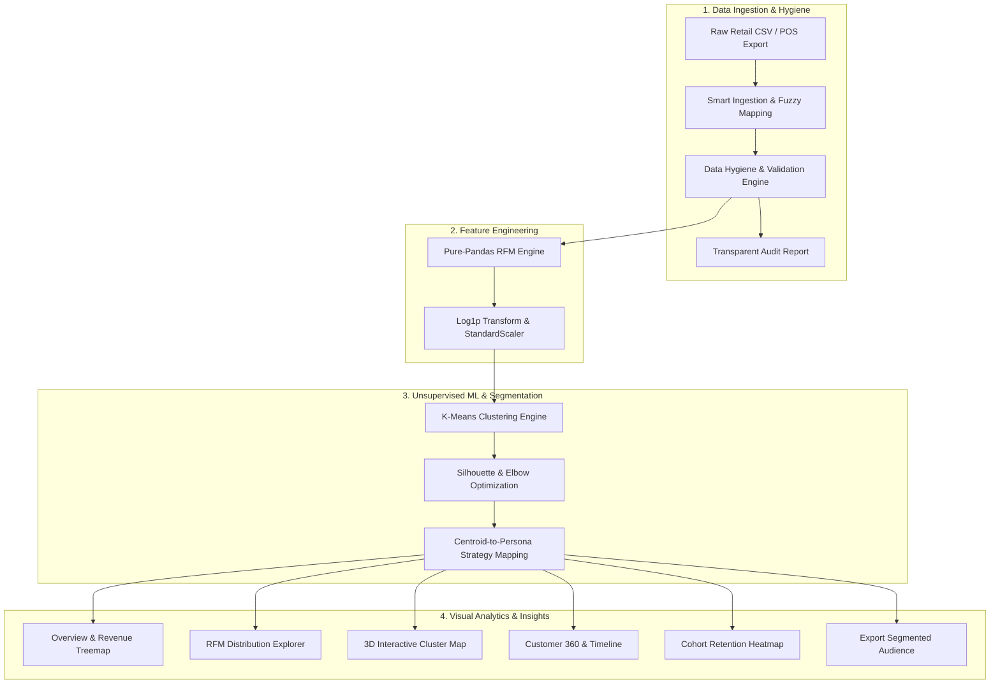

# 🎯 RFM Cluster360 — Customer Intelligence & Behavioral Segmentation

[](https://www.python.org/)
[](https://streamlit.io/)
[](https://scikit-learn.org/)
[](https://plotly.com/)
[](LICENSE)

An enterprise-ready customer intelligence and segmentation platform that transforms raw retail transaction exports into actionable customer personas using **Recency, Frequency, and Monetary (RFM)** modeling and **Unsupervised Machine Learning (K-Means Clustering)**.

---

## 🌟 Key Features

1. **Intelligent Ingestion & Auto-Column Mapping**
   - Upload any standard retail transaction CSV (Shopify, WooCommerce, Square, POS exports).
   - Fuzzy matching and alias detection automatically map column variations (e.g. `cust_id`, `ClientID`, `InvoiceNo`, `created_at`).
   - Supports multiple encodings (`utf-8`, `latin-1`, `cp1252`, `iso-8859-1`) with size guards.

2. **Transparent Data Hygiene Audit**
   - Automatically filters guest checkouts, cancelled orders (`C` prefix), returns (negative quantities), and zero-price freebies.
   - Shows clear before/after counts and an itemized breakdown of filtered rows without silent data loss.

3. **Pure-Pandas RFM Engine**
   - Computes **Recency** (days since last purchase), **Frequency** (count of distinct orders), and **Monetary** (total lifetime spend) per customer.
   - Configurable reference snapshot date (defaults to day after last transaction).

4. **Self-Optimizing K-Means Clustering**
   - Right-skewed distributions are normalized with $\log(1+x)$ transformations followed by `StandardScaler`.
   - Automatically searches $k=2$ through $8$ and selects the optimal cluster count using **Silhouette Score** optimization and the **Elbow Method**.
   - Allows instant manual override via a sidebar slider.

5. **Explainable Customer Personas**
   - Translates mathematical cluster centroids into intuitive business personas:
     - 🏆 **Champions**: Top spenders who buy frequently and recently.
     - 🤝 **Loyal Customers**: Regular buyers with solid lifetime value.
     - 🚀 **Potential Loyalists**: Recent shoppers with high potential.
     - 🌱 **New Customers**: First-time or very recent buyers.
     - ⚠️ **At Risk**: High historical spenders who haven't returned in a long time.
     - 💤 **About to Sleep / Lost**: Inactive customer base.
   - Provides concrete marketing action recommendations for each group.

6. **Interactive 5-View Analytics Dashboard**
   - **📊 Overview**: High-level KPIs, customer count/revenue distribution by segment, market treemaps, and strategic playbooks.
   - **🔍 RFM Explorer**: Metric distribution histograms, percentile statistics, and Elbow & Silhouette model diagnostics.
   - **🗺️ 3D Cluster Map**: Fully rotatable 3D customer space with zoom, pan, and 2D cross-section projections.
   - **👤 Customer Search**: Look up individual accounts, benchmark rankings across the base, and purchase timelines.
   - **📈 Cohort Retention**: Monthly acquisition cohort retention heatmap matrix.

7. **One-Click Export**
   - Download the full segmented customer list with RFM metrics, cluster IDs, and persona labels in UTF-8 CSV format.

---

## 🏛️ Project Architecture

### End-to-End Data Pipeline Flow



### Directory Structure

```
rfm-cluster360/
├── app.py                          # Streamlit entrypoint & pipeline orchestrator
├── requirements.txt                # Pinned dependencies
├── .env.example                    # Template for environment variables
├── .gitignore
├── README.md
│
├── config/
│   └── settings.py                 # Configuration constants, aliases, and color palettes
│
├── data/
│   └── sample_retail.csv           # Built-in demo transaction dataset
│
├── src/                            # Pure business logic (Zero UI / Streamlit dependencies)
│   ├── ingestion.py                # CSV loading, encoding fallbacks, fuzzy column mapping
│   ├── cleaning.py                 # Row validation, hygiene rules, audit report dataclass
│   ├── rfm.py                      # RFM calculation & statistical summaries
│   ├── clustering.py               # Log transforms, scaling, K-Means, silhouette evaluation
│   ├── personas.py                 # Centroid classification & business strategy mapping
│   ├── cohort.py                   # Monthly acquisition cohort retention matrix
│   └── export.py                   # Clean CSV serialization
│
├── pages/                          # Streamlit Multipage Navigation
│   ├── 1_📊_Overview.py
│   ├── 2_🔍_RFM_Explorer.py
│   ├── 3_🗺️_Cluster_Map.py
│   ├── 4_👤_Customer_Search.py
│   └── 5_📈_Cohort_Retention.py
│
├── components/                     # Reusable Streamlit UI widgets
│   ├── metric_cards.py             # Executive KPI metrics & persona cards
│   ├── filters.py                  # Sidebar segment, country, and spend range filters
│   ├── data_preview.py             # Column mapping editor & cleaning audit cards
│   └── download_button.py          # Formatted export download button
│
├── viz/                            # Chart builders (Return pure Plotly Figures)
│   ├── overview_charts.py          # Segment volume, revenue, treemap, 2D landscape
│   ├── rfm_charts.py               # Histograms, elbow curve, silhouette curve, radar
│   ├── cluster_scatter.py          # 3D scatter & 2D pairwise projections
│   ├── customer_timeline.py        # Individual customer timeline & percentile ranking
│   └── cohort_heatmap.py           # Annotated cohort retention heatmap
│
└── tests/                          # Automated Pytest Suite
    ├── conftest.py                 # Hand-calculated transaction fixtures & synthetic base
    ├── test_ingestion.py
    ├── test_cleaning.py
    ├── test_rfm.py
    ├── test_clustering.py
    ├── test_personas.py
    └── test_cohort.py
```

---

## 🚀 Quickstart Guide

### 1. Clone Repository & Create Virtual Environment

```bash
# Clone repository
git clone https://github.com/Khare69/RFM-Cluster360.git
cd rfm-cluster360

# Create virtual environment
python -m venv .venv

# Activate virtual environment
# Windows:
.venv\Scripts\activate
# Linux/macOS:
source .venv/bin/activate
```

### 2. Install Dependencies

```bash
pip install -r requirements.txt
```

### 3. Run the Web Application

```bash
streamlit run app.py
```

The app will open automatically in your browser at `http://localhost:8501`.

---

## 🧪 Running the Test Suite

```bash
pytest tests/ -v
```

---

## 📄 License

Distributed under the Apache 2.0 License.
