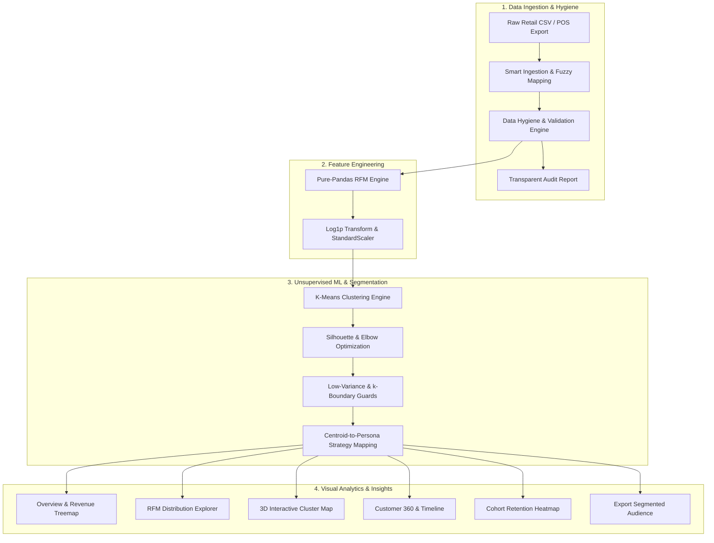

# 🎯 RFM Cluster360 — Customer Intelligence & Behavioral Segmentation

[](https://www.python.org/)
[](https://streamlit.io/)
[](https://scikit-learn.org/)
[](https://plotly.com/)
[](#-running-the-test-suite)
[](LICENSE)

An enterprise-ready customer intelligence and segmentation platform that transforms raw retail transaction exports into actionable customer personas using **Recency, Frequency, and Monetary (RFM)** modeling and **Unsupervised Machine Learning (K-Means Clustering)**.

---

## 🌟 Key Features

1. **Intelligent Ingestion & Auto-Column Mapping**
   - Upload any standard retail transaction CSV (Shopify, WooCommerce, Square, POS exports).
   - Fuzzy matching and alias detection automatically map column variations (e.g. `cust_id`, `ClientID`, `InvoiceNo`, `created_at`).
   - Supports multiple encodings (`utf-8`, `latin-1`, `cp1252`, `iso-8859-1`) with file size validation guards.
   - Robust input handling supporting file paths, raw bytes, and `io.StringIO` / `io.BytesIO` objects.

2. **Transparent Data Hygiene Audit & Integrity Engine**
   - Automatically filters guest checkouts, cancelled orders (`C` prefix), returns, and zero-price test line items.
   - **Accounting Negatives:** Converts accounting parenthesis format (e.g., `(10.50)` &rarr; `-10.50`) to avoid converting refunds into positive revenue.
   - **ID Normalization:** Harmonizes mixed-type customer IDs (e.g. float `1001.0` and string `"1001.0"` &rarr; `"1001"`).
   - **Invoice Validation:** Filters null or empty invoice numbers to prevent orphaned zero-frequency customer profiles.
   - Displays clear before/after counts and an itemized breakdown of filtered rows without silent data loss.

3. **Pure-Pandas RFM Engine**
   - Computes **Recency** (days since last purchase), **Frequency** (count of distinct orders), and **Monetary** (total lifetime spend) per customer.
   - Configurable reference snapshot date (defaults to midnight after the latest transaction).

4. **Self-Optimizing K-Means Clustering & Guardrails**
   - Normalizes right-skewed distributions with $\log(1+x)$ transformations followed by `StandardScaler`.
   - Automatically searches $k=2$ through $8$ and identifies optimal clustering using **Silhouette Score** maximization and the **Elbow Method**.
   - **Low-Variance Guard:** Detects uniform/near-zero variance data (`std < 0.01`) before fitting to prevent convergence warnings and warn users proactively.
   - Dynamic sidebar slider for instant interactive $k$ adjustments with edge-case protection.

5. **Explainable Customer Personas & Strategy Mapping**
   - **Weighted Composite Ranking:** Centroids are ranked via a balanced composite ($0.35 \times R_{\text{inv}} + 0.35 \times F + 0.30 \times M$), ensuring the top cluster always receives top-tier classification.
   - Translates mathematical cluster centroids into intuitive business personas:
     - 🏆 **Champions**: Top spenders who buy frequently and recently.
     - 🤝 **Loyal Customers**: Regular repeat buyers with solid lifetime value.
     - 🚀 **Potential Loyalists**: Recent shoppers with high growth potential.
     - 🌱 **New Customers**: First-time or very recent buyers.
     - ⚠️ **At Risk**: High historical spenders who haven't returned recently.
     - 💤 **About to Sleep / Lost**: Inactive customer base.
   - **Collision-Free Qualifiers:** Automatically appends ordinal qualifiers (e.g., `Needs Attention (Tier 2)`) when $k \ge 10$ to ensure every cluster retains a distinct label.
   - Actionable marketing recommendations and targeted campaign playbooks for each persona.

6. **Interactive 5-View Analytics Dashboard**
   - **📊 Overview**: High-level KPIs, customer count/revenue distribution by segment, market treemaps, and zero-spend protected scatter plots.
   - **🔍 RFM Explorer**: Metric distribution histograms, percentile statistics, and Elbow & Silhouette model diagnostics.
   - **🗺️ 3D Cluster Map**: Fully rotatable 3D customer space with zoom, pan, and 2D cross-section projections.
   - **👤 Customer Search**: Look up individual accounts, benchmark rankings across the base, and purchase timelines.
   - **📈 Cohort Retention**: Monthly acquisition cohort retention heatmap with contiguous period reindexing and adaptive high-contrast font colors.

7. **Blazing-Fast Reactive Performance**
   - Computationally intensive functions (`load_csv`, `calculate_rfm`, `preprocess_rfm`, `evaluate_clusters`) are accelerated with `@st.cache_data`.
   - Instant response times on sidebar filter changes and interactive exploration.

8. **One-Click Export**
   - Download the full segmented customer list with RFM metrics, cluster IDs, and persona labels in UTF-8 CSV format.

---

## 🏛️ Project Architecture

### End-to-End Data Pipeline Flow



### Directory Structure

```
rfm-cluster360/
├── app.py                          # Streamlit entrypoint & pipeline orchestrator
├── requirements.txt                # Pinned dependencies
├── .env.example                    # Template for environment variables
├── .gitignore
├── README.md
├── LICENSE                         # Apache 2.0 License
├── pyrightconfig.json              # Python static type checking configuration
│
├── config/
│   └── settings.py                 # Configuration constants, aliases, and color palettes
│
├── data/
│   └── sample_retail.csv           # Built-in demo transaction dataset
│
├── src/                            # Core computational engine (Modular, testable, zero UI dependencies)
│   ├── ingestion.py                # CSV loading, encoding fallbacks, fuzzy column mapping, @st.cache_data
│   ├── cleaning.py                 # Hygiene rules, accounting negatives, ID normalization, CleaningReport
│   ├── rfm.py                      # Pure-Pandas RFM calculation, summary stats, @st.cache_data
│   ├── clustering.py               # Log transforms, scaling, K-Means, silhouette evaluation, variance guard
│   ├── personas.py                 # Composite score ranking, collision-free persona classification
│   ├── cohort.py                   # Monthly acquisition cohort retention matrix with contiguous reindexing
│   └── export.py                   # Clean CSV serialization
│
├── pages/                          # Streamlit Multipage Navigation
│   ├── 1_📊_Overview.py            # High-level KPIs, distributions, and playbooks
│   ├── 2_🔍_RFM_Explorer.py        # Distributions, percentile metrics, model diagnostics
│   ├── 3_🗺️_Cluster_Map.py         # 3D interactive customer space & 2D slices
│   ├── 4_👤_Customer_Search.py     # Customer lookup, timeline, and percentile rankings
│   └── 5_📈_Cohort_Retention.py    # Acquisition cohort retention heatmaps
│
├── components/                     # Reusable Streamlit UI widgets
│   ├── metric_cards.py             # Executive KPI metrics & persona cards
│   ├── filters.py                  # Sidebar segment, country, and bounded spend range filters
│   ├── data_preview.py             # Column mapping editor & itemized cleaning audit cards
│   └── download_button.py          # Formatted export download button
│
├── viz/                            # Chart builders (Return pure Plotly Figures)
│   ├── overview_charts.py          # Segment volume, revenue, treemap, log-safe scatter plot
│   ├── rfm_charts.py               # Histograms, elbow curve, silhouette curve, radar charts
│   ├── cluster_scatter.py          # 3D scatter & 2D pairwise projections
│   ├── customer_timeline.py        # Individual customer timeline & percentile ranking
│   └── cohort_heatmap.py           # Annotated cohort retention heatmap with adaptive text contrast
│
└── tests/                          # Automated Pytest Suite (28 Passed)
    ├── conftest.py                 # Hand-calculated transaction fixtures & synthetic base
    ├── test_ingestion.py           # Encodings, empty files, fuzzy mapping, duplicate detection, StringIO
    ├── test_cleaning.py            # Deduplication, currency strings, accounting negatives, ID normalization, null invoices
    ├── test_rfm.py                 # Hand-calculated RFM metrics, snapshot dates, summary stats, zero-monetary scatter
    ├── test_clustering.py          # Preprocessing, evaluation, profiles, low-variance guard
    ├── test_personas.py            # Centroid labeling, synthetic customer groups, k=10 collision handling
    └── test_cohort.py              # Cohort retention calculations, KPIs, non-contiguous month reindexing
```

---

## 🗺️ Engineering Roadmap & Implementation Progress

| Phase | Milestone | Focus Areas | Status |
|:---:|---|---|:---:|
| **0** | **Repository Bootstrap** | Git repo initialization, `.gitignore`, architecture documentation, initial push | ✅ Complete |
| **1** | **Critical Bug Fixes** | Slider step overflow, duplicate column mapping, StringIO type error, k-slider edge cases | ✅ Complete |
| **2** | **Data Integrity & Cleaning** | Accounting parentheses, float-string ID normalization, null invoice validation | ✅ Complete |
| **3** | **ML Pipeline Robustness** | Percentile composite persona ranking, $k \ge 10$ collision qualifiers, low-variance clustering guard | ✅ Complete |
| **4** | **Visualization & UI** | Cohort contiguous month reindexing, adaptive heatmap text contrast, log-scale $0 scatter safety, `@st.cache_data` | ✅ Complete |
| **5** | **Cloud Integration** | AWS S3 bucket ingestion/export with local mock mode + Apache Parquet support | 📋 Upcoming |
| **6** | **Containerization** | Multi-stage production `Dockerfile`, `docker-compose`, port configuration | 📋 Upcoming |
| **7** | **MLOps Registry** | Joblib/MLflow model artifact serialization, metadata tracking, versioned registry | 📋 Upcoming |
| **8** | **CI/CD Pipeline** | GitHub Actions workflow for linting, pytest matrix, container builds | 📋 Upcoming |

---

## 🚀 Quickstart Guide

### 1. Clone Repository & Create Virtual Environment

```bash
# Clone repository
git clone https://github.com/Khare69/RFM-Cluster360.git
cd rfm-cluster360

# Create virtual environment
python -m venv .venv

# Activate virtual environment
# Windows:
.venv\Scripts\activate
# Linux/macOS:
source .venv/bin/activate
```

### 2. Install Dependencies

```bash
pip install -r requirements.txt
```

### 3. Run the Web Application

```bash
streamlit run app.py
```

The app will open automatically in your browser at `http://localhost:8501`.

---

## 🧪 Running the Test Suite

The codebase is backed by an automated test suite with hand-verified assertions:

```bash
pytest tests/ -v
```

```text
============================= test session starts =============================
platform win32 -- Python 3.14.7, pytest-9.1.1
collected 28 items

tests/test_cleaning.py::test_clean_transactions PASSED                   [  3%]
tests/test_cleaning.py::test_clean_transactions_remove_duplicates PASSED [  7%]
tests/test_cleaning.py::test_detect_duplicates PASSED                    [ 10%]
tests/test_cleaning.py::test_clean_transactions_with_currency_strings PASSED [ 14%]
tests/test_cleaning.py::test_clean_transactions_with_accounting_negatives PASSED [ 17%]
tests/test_cleaning.py::test_clean_id_normalizes_float_strings PASSED    [ 21%]
tests/test_cleaning.py::test_clean_transactions_null_invoice_no PASSED   [ 25%]
tests/test_clustering.py::test_preprocess_rfm PASSED                     [ 28%]
tests/test_clustering.py::test_evaluate_clusters PASSED                  [ 32%]
tests/test_clustering.py::test_run_kmeans_and_build_df PASSED            [ 35%]
tests/test_clustering.py::test_evaluate_clusters_low_variance PASSED     [ 39%]
tests/test_cohort.py::test_build_cohort_matrix PASSED                    [ 42%]
tests/test_cohort.py::test_build_cohort_matrix_non_contiguous_months PASSED [ 46%]
tests/test_ingestion.py::test_load_csv_from_string_io PASSED             [ 50%]
tests/test_ingestion.py::test_load_csv_empty_file PASSED                 [ 53%]
tests/test_ingestion.py::test_load_csv_latin1_encoding PASSED            [ 57%]
tests/test_ingestion.py::test_auto_map_columns_exact PASSED              [ 60%]
tests/test_ingestion.py::test_auto_map_columns_fuzzy_and_aliases PASSED  [ 64%]
tests/test_ingestion.py::test_validate_mapping PASSED                    [ 67%]
tests/test_ingestion.py::test_validate_mapping_duplicate_columns PASSED  [ 71%]
tests/test_ingestion.py::test_load_csv_from_string_io_object PASSED      [ 75%]
tests/test_personas.py::test_label_segments_with_synthetic PASSED        [ 78%]
tests/test_personas.py::test_label_segments_k10_unique_labels PASSED     [ 82%]
tests/test_rfm.py::test_calculate_rfm_hand_calculated PASSED             [ 85%]
tests/test_rfm.py::test_default_snapshot_date PASSED                     [ 89%]
tests/test_rfm.py::test_calculate_rfm_snapshot_in_past_error PASSED      [ 92%]
tests/test_rfm.py::test_get_rfm_summary_stats PASSED                     [ 96%]
tests/test_rfm.py::test_rfm_summary_scatter_zero_monetary PASSED         [100%]

============================= 28 passed in 4.44s ==============================
```

---

## 📄 License

Distributed under the [Apache 2.0 License](LICENSE).
